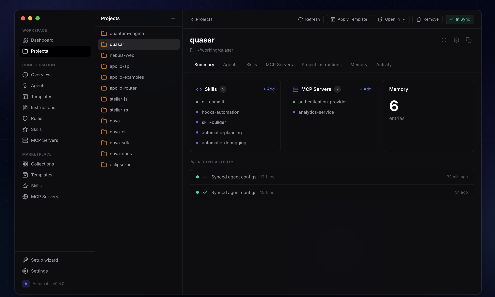

# Automatic

Manage and sync your skills, MCP servers, rules, and project instructions. Works with Claude, Codex, Cursor, and other MCP-compatible agent tools.

<p>
  <a href="https://tryautomatic.app">Website</a>
  ·
  <a href="https://github.com/velvet-tiger/automatic/releases/latest">Latest release</a>
</p>

<p>
  <a href="https://github.com/velvet-tiger/automatic/releases/latest">
    
  </a>
</p>

---



Automatic is a desktop hub for managing AI agent configuration across projects. It gives you one place to organise the skills, MCP servers, rules, templates, and project settings that power your agents, then syncs that configuration into the tools you actually use.

The goal is simple: capture the patterns that work once, reuse them everywhere, and stop rebuilding agent context from scratch for every new project.

## Why Automatic

- Keep project instructions, rules, skills, and MCP servers in one place
- Sync configuration into agent tools instead of maintaining each tool manually
- Detect drift when a project no longer matches the saved configuration
- Reuse proven setups through templates and cloned projects
- Browse and install skills and MCP servers from curated marketplaces
- Expose an MCP server so agents can pull skills, memory, and project configuration directly from Automatic

## Who It Is For

Automatic is for teams and individuals who use agent tools heavily and want consistent context across projects.

It is especially useful if you:

- switch between Claude Code, Codex, Cursor, and other tools
- maintain the same MCP servers or instructions in multiple places
- want reusable project templates for common workflows
- need agents to read shared memory, skills, or project configuration over MCP

## How It Works

Automatic is a hub, not an executor.

It does not run agents for you. Instead, it stores and organises the configuration your agents need:

1. Define skills, MCP servers, rules, templates, and project instructions in Automatic.
2. Assign those resources to a project.
3. Sync that project into supported agent tools.
4. Let agents connect to Automatic's MCP server to read project context, skills, and memory.

That separation matters because it keeps your configuration portable. Your agents can change. Your context stays consistent.

## Install

Automatic runs on macOS, Windows, and Linux.

- Download the latest desktop build from the [latest release](https://github.com/velvet-tiger/automatic/releases/latest)
- Or start from [tryautomatic.app](https://tryautomatic.app)

After installing:

1. Open Automatic.
2. Configure your agent tools and projects.
3. Add the skills, rules, MCP servers, and templates you want to reuse.
4. Sync the project configuration into your local agent setup.

## Quick Start

1. Install and open Automatic.
2. Create or import a project.
3. Add the skills, rules, and MCP servers that project needs.
4. Sync the project to your agent tool.
5. Use the marketplaces to import additional skills, MCP servers, or templates.
6. Let connected agents pull project context and memory from Automatic over MCP.

## Core Features

### Configuration Hub

- Manage skills, rules, MCP servers, sub-agents, and project instructions
- Keep shared configuration separate from any single agent tool

### Project Sync

- Apply configuration consistently across projects
- Detect configuration drift
- Clone an existing project as a starting point for a new one

### Reusable Templates

- Bundle skills, MCP servers, rules, and instructions into project templates
- Import pre-built templates from the marketplace

### Marketplaces

- Browse and install skills from skills.sh
- Connect MCP servers from a curated directory

### MCP Service

- Expose an MCP server interface for agents to read skills, project config, and memory
- Support agent workflows that need shared, persistent context

## Supported Tools

Automatic is designed to work with Claude, Codex, Cursor, and other MCP-compatible agent tools.

The exact experience depends on the target tool and its MCP/configuration support, but the model is the same: Automatic stores the configuration, then syncs or serves it to the tool that needs it.

## Privacy and Security

Automatic stores and manages local agent configuration on your machine.

- OAuth tokens are stored in the system keychain where applicable
- MCP server and project configuration are managed locally by the desktop app

If you are evaluating Automatic for a team, review the app configuration and MCP server setup for your environment before rolling it out broadly.

## Development

This repository contains the Automatic desktop app built with Tauri 2, Rust, React, and TypeScript.

### Prerequisites

- Node.js
- Rust toolchain
- Tauri 2 build prerequisites for your platform

### Run Locally

```bash
npm install
npm run tauri dev
```

### Build

```bash
npm run build
```

### Check and Test

```bash
npm run check
npm run test
```

Equivalent lower-level commands:

```bash
cd src-tauri
cargo check
cargo test
```

## Architecture

The desktop app has two main parts:

- A React and TypeScript frontend for managing projects, skills, templates, settings, and marketplaces
- A Rust backend that handles business logic, local configuration, syncing, and the MCP server

At a high level:

- `src/App.tsx` provides the shell and navigation
- `src-tauri/src/core.rs` contains shared backend logic
- `src-tauri/src/mcp.rs` implements the MCP server
- `src-tauri/src/lib.rs` exposes Tauri commands
- `src-tauri/src/main.rs` starts either the desktop app or the MCP server

## Project Status

Automatic currently includes:

- project, skills, rules, templates, and MCP server management
- curated marketplaces for skills, templates, and MCP servers
- drift detection
- analytics and updater integration
- memory tools and MCP server support

## License

Automatic is released under the **Business Source License 1.1**.

- **Free use**: Internal business use with up to 10 concurrent users
- **Commercial license required**: For use beyond 10 users, distribution, resale, or SaaS deployment
- **Attribution required**: Forks must attribute the original Licensor
- **Time-delayed open source**: Converts to MIT License on March 23, 2030

See [LICENSE](LICENSE) for full terms and [LICENSE-COMMERCIAL](LICENSE-COMMERCIAL) for commercial licensing details.

For commercial licenses, contact: licenses@automatic.dev

## Links

- Website: [tryautomatic.app](https://tryautomatic.app)
- Latest release: [github.com/velvet-tiger/automatic/releases/latest](https://github.com/velvet-tiger/automatic/releases/latest)

