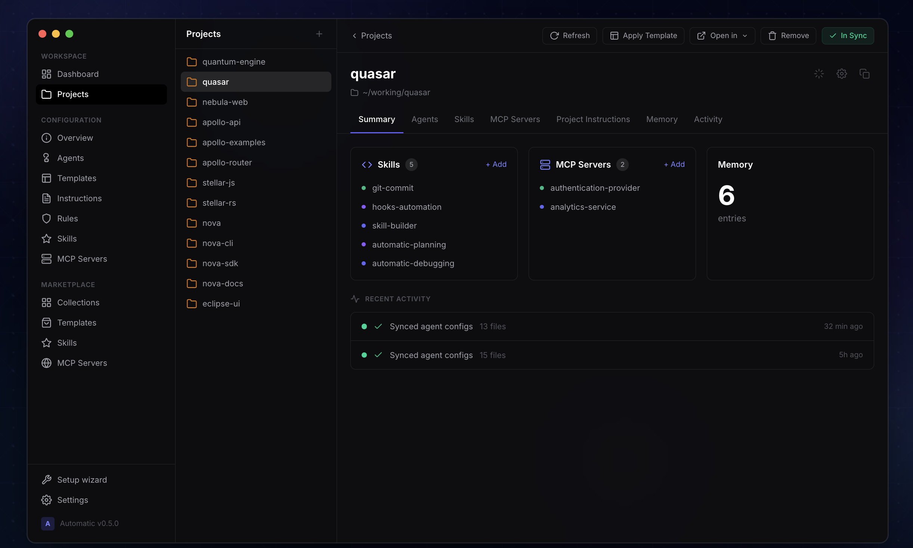

# Automatic

Manage and sync your skills, MCP servers, rules, and project instructions. Works with Claude Code, Codex, Cursor, and 13 other agent tools.

<p>
  <a href="https://tryautomatic.app">Website</a>
  ·
  <a href="https://github.com/velvet-tiger/automatic/releases/latest">Latest release</a>
</p>

<p>
  <a href="https://github.com/velvet-tiger/automatic/releases/latest">
    
  </a>
</p>

---



Automatic is a desktop hub for managing AI agent configuration across projects. It gives you one place to organise the skills, MCP servers, rules, templates, and project settings that power your agents, then syncs that configuration into the tools you actually use.

The goal is simple: capture the patterns that work once, reuse them everywhere, and stop rebuilding agent context from scratch for every new project.

## Why Automatic

- Keep project instructions, rules, skills, and MCP servers in one place
- Sync configuration into agent tools instead of maintaining each tool manually
- Detect drift when a project no longer matches the saved configuration
- Reuse proven setups through templates and cloned projects
- Browse and install skills and MCP servers from curated marketplaces
- Expose an MCP server so agents can pull skills, memory, and project configuration directly from Automatic
- Store and retrieve project memory across sessions so agents retain context over time

## Who It Is For

Automatic is for teams and individuals who use agent tools heavily and want consistent context across projects.

It is especially useful if you:

- switch between Claude Code, Codex, Cursor, and other tools
- maintain the same MCP servers or instructions in multiple places
- want reusable project templates for common workflows
- need agents to read shared memory, skills, or project configuration over MCP
- want a feature board that agents can read and update as they work

## How It Works

Automatic is a hub, not an executor.

It does not run agents for you. Instead, it stores and organises the configuration your agents need:

1. Define skills, MCP servers, rules, templates, and project instructions in Automatic.
2. Assign those resources to a project.
3. Sync that project into supported agent tools.
4. Let agents connect to Automatic's MCP server to read project context, skills, and memory.

That separation matters because it keeps your configuration portable. Your agents can change. Your context stays consistent.

## Install

Automatic runs on macOS, Windows, and Linux.

- Download the latest desktop build from the [latest release](https://github.com/velvet-tiger/automatic/releases/latest)
- Or start from [tryautomatic.app](https://tryautomatic.app)

After installing:

1. Open Automatic.
2. Configure your agent tools and projects.
3. Add the skills, rules, MCP servers, and templates you want to reuse.
4. Sync the project configuration into your local agent setup.

## Quick Start

1. Install and open Automatic.
2. Create or import a project.
3. Add the skills, rules, and MCP servers that project needs.
4. Sync the project to your agent tool.
5. Use the marketplaces to import additional skills, MCP servers, or templates.
6. Let connected agents pull project context and memory from Automatic over MCP.

## Core Features

### Projects

Each project in Automatic maps to a directory on disk and brings together all the configuration an agent needs:

- **Instructions** — project-level instruction files that guide agent behaviour
- **Rules** — code style, review checklists, debugging methodology, and other behavioural constraints
- **Skills** — reusable prompt-based capabilities assigned to the project (global or project-local custom skills)
- **MCP Servers** — Model Context Protocol servers the project depends on
- **Agents** — which agent tools (Claude Code, Cursor, Codex, etc.) are enabled for the project
- **Sub-agents** — specialised agent configurations for specific tasks
- **Commands** — custom commands scoped to the project
- **Context** — auto-generated project snapshot (directory tree, config files, key documentation) for AI consumption
- **Documentation** — links to external docs relevant to the project
- **Plugins** — extend project capabilities with additional integrations

Projects can be organised into **groups** for related codebases, cloned as starting points for new work, and synced into agent tools with one click.

### Library

The library is a global registry of reusable resources that can be assigned to any project:

- **Templates** — groups of instructions bundled together for common scenarios
- **Instructions** — standalone instruction files for agent guidance
- **Rules** — reusable rules for code quality, security, review, and more
- **Sub-Agents** — pre-configured agent roles for specialised tasks
- **Commands** — reusable command definitions
- **Skills** — prompt-based capabilities (19 bundled skills covering code review, testing, debugging, security, performance, documentation, and framework-specific guidance for Laravel, PHP, Python, Terraform, Tailwind CSS, React/Next.js)
- **MCP Servers** — Model Context Protocol server configurations
- **Providers** — supported agent tools and their sync settings
- **Tools** — available tool integrations

Skills can be installed from the marketplace, created locally, or scoped to individual projects. They are synced to agent tool directories as symlinks or copies (configurable).

### Marketplace

Browse, search, and install community resources:

- **Collections** — curated bundles of skills, MCP servers, and templates grouped by workflow or domain
- **Templates** — pre-built project configurations ready to import
- **Skills** — community skills from the [skills.sh](https://skills.sh) registry
- **MCP Servers** — a curated directory of Model Context Protocol servers

### Project Sync

- Sync configuration into 16 supported agent tools with one click
- Auto-detect installed agents and import their existing MCP server configs
- Detect configuration drift when on-disk files diverge from saved state
- Rebuild or recover configuration when drift is detected
- Apply templates to projects to quickly set up a standard configuration

### MCP Service

Automatic exposes a full MCP server (over stdio) with 27 tools that agents can call directly:

| Category | Tools |
|---|---|
| **Projects** | List, read, sync projects; get project context; discover related projects via groups |
| **Skills** | List, read, search skills (global and project-local) |
| **Memory** | Store, get, list, search, delete memory entries; read Claude Code auto-memory files |
| **Features** | Create, list, get, update, archive, delete features; set lifecycle state; add progress updates |
| **Credentials** | Retrieve API keys for LLM providers (Anthropic, OpenAI, Gemini, and others) |
| **MCP Servers** | List registered MCP server configurations |
| **Sessions** | List active Claude Code sessions tracked by Automatic |

Run the MCP server standalone with `automatic mcp-serve` or let the desktop app serve it automatically.

### Feature Tracking

- Built-in Kanban-style feature board with states: backlog, todo, in progress, review, complete, cancelled
- Agents can create, update, and progress features through MCP tools as they work
- Priority levels, effort estimates, assignees, tags, and linked files per feature
- Append progress updates to features for a running log of decisions and blockers
- Archive and restore features to keep the board clean

### Memory System

- Project-scoped key-value store that persists across sessions
- Agents store architectural decisions, conventions, gotchas, and setup notes
- Full-text search across keys and values
- Integrates with Claude Code's auto-memory (MEMORY.md) for seamless context sharing

### Credentials and Security

- Store LLM provider API keys securely in the system keychain
- OAuth 2.0 flow support for MCP server authentication
- Encrypted environment variable storage (AES-GCM)
- Agents retrieve credentials via MCP without exposing raw keys

### Utilities

- **Token Estimator** — estimate token counts for messages before sending them to an LLM
- **Insights** — AI-powered recommendations for skills, MCP servers, and agents per project

## Supported Agent Tools

Automatic syncs configuration into 16 agent tools:

| Tool | Sync Support |
|---|---|
| Claude Code | Skills, MCP servers, rules, project instructions |
| Cursor | MCP servers, rules |
| Codex CLI | MCP servers, rules |
| Cline | MCP servers, rules |
| GitHub Copilot | MCP servers, rules |
| Zed | MCP servers |
| Warp | MCP servers |
| Gemini CLI | MCP servers |
| OpenCode | MCP servers |
| Goose | MCP servers |
| Junie | MCP servers |
| Kilo Code | MCP servers |
| Kiro | MCP servers |
| Antigravity | MCP servers |
| Droid | MCP servers |
| Generic MCP | MCP servers |

The exact sync capabilities depend on each tool's configuration format. Automatic auto-detects installed tools and writes to their config directories.

## Privacy and Security

Automatic stores and manages local agent configuration on your machine.

- All configuration is file-based and stored locally (no external database)
- OAuth tokens and API keys are stored in the platform-native keychain
- Sensitive environment variables are encrypted at rest with AES-GCM
- Analytics are opt-in only and can be disabled at any time

If you are evaluating Automatic for a team, review the app configuration and MCP server setup for your environment before rolling it out broadly.

## Development

This repository contains the Automatic desktop app built with Tauri 2, Rust, React 19, and TypeScript.

### Prerequisites

- Node.js
- Rust toolchain
- Tauri 2 build prerequisites for your platform

### Run Locally

```bash
npm install
npm run tauri dev
```

### Build

```bash
make build        # Full Tauri production build
npm run build     # Frontend only
```

### Check and Test

```bash
make check        # Frontend type check + Rust clippy
cargo test        # Rust unit tests (from src-tauri/)
npm run lint      # TypeScript type checking
```

## Architecture

The desktop app has two main parts:

- A **React + TypeScript frontend** for managing projects, skills, templates, marketplaces, and settings
- A **Rust backend** (Tauri 2) that handles business logic, local configuration, syncing, and the MCP server

The application runs in three modes:

1. **Desktop GUI** (default) — full UI for managing configuration
2. **MCP server** (`mcp-serve`) — standalone stdio-based MCP server exposing 27 tools
3. **MCP proxy** (`mcp-proxy`) — transparent proxy with keychain-based authentication

Key source locations:

- `src/App.tsx` — Shell and tab-based navigation
- `src-tauri/src/core/` — Business logic (skills, projects, MCP servers, rules, templates, commands, marketplace)
- `src-tauri/src/mcp.rs` — MCP server implementation (rmcp SDK)
- `src-tauri/src/sync/` — Sync engine with drift detection
- `src-tauri/src/memory.rs` — Key-value memory storage
- `src-tauri/src/context.rs` — AI context generation
- `src-tauri/src/agent/` — Agent tool integrations (16 providers)

## License

Automatic is released under the **Business Source License 1.1**.

- **Free use**: Internal business use with up to 10 concurrent users
- **Commercial license required**: For use beyond 10 users, distribution, resale, or SaaS deployment
- **Attribution required**: Forks must attribute the original Licensor
- **Time-delayed open source**: Converts to MIT License on March 23, 2030

See [LICENSE](LICENSE) for full terms

## Links

- Website: [tryautomatic.app](https://tryautomatic.app)
- Latest release: [github.com/velvet-tiger/automatic/releases/latest](https://github.com/velvet-tiger/automatic/releases/latest)

